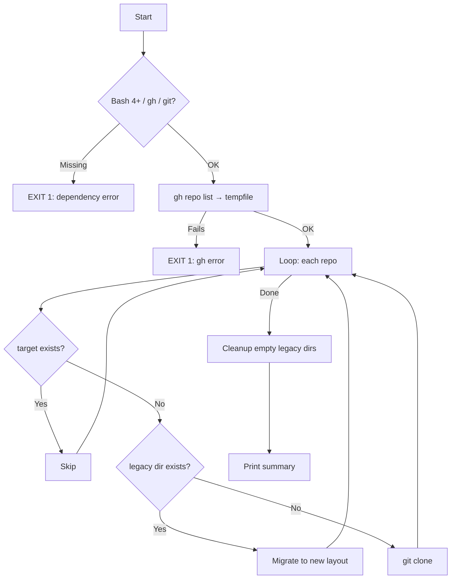

<p align="center">
  
</p>

<h1 align="center">clone-gh-repos</h1>

<p align="center">
  <strong>Bulk-clone all repositories from any GitHub user or organisation, organised by visibility and primary language.</strong>
</p>

<p align="center">
  <a href="https://github.com/sebastienrousseau/clone-gh-repos/actions"></a>
  <a href="https://github.com/sebastienrousseau/clone-gh-repos/releases/latest"></a>
  <a href="LICENSE"></a>
</p>

---

## Overview

A single idempotent script that mirrors an entire GitHub account into a clean local tree. Re-running it skips repos that are already cloned and only fetches new ones. Legacy flat layouts are migrated automatically.

```
~/Code/
├── Public/
│   ├── rust/
│   │   └── my-crate/
│   ├── typescript/
│   │   └── my-app/
│   └── other/
│       └── dotfiles/
└── Private/
    └── python/
        └── internal-tool/
```

> **Note:** Private repos are only cloned if your `gh` token has access to them. Public repos from any user or organisation are always available.

---

## Prerequisites

| Tool | Install |
|:-----|:--------|
| Bash 4+ | macOS: `brew install bash` / Linux & WSL: pre-installed |
| [Git](https://git-scm.com/) | macOS: `brew install git` / Linux & WSL: `sudo apt install git` |
| [GitHub CLI (`gh`)](https://cli.github.com/) | macOS: `brew install gh` / Linux & WSL: `sudo apt install gh` or see [install docs](https://github.com/cli/cli/blob/trunk/docs/install_linux.md) |

After installing `gh`, authenticate:

```bash
gh auth login
```

---

## Usage

```bash
./clone-gh-repos.sh <owner> [base_dir] [limit]
```

| Parameter | Required | Default | Description |
|:----------|:---------|:--------|:------------|
| `owner` | **yes** | — | GitHub username or organisation |
| `base_dir` | no | `$HOME/Code` | Root directory for the cloned tree |
| `limit` | no | `1000` | Maximum number of repos to list via `gh` |

### Examples

Clone all your own repos:

```bash
./clone-gh-repos.sh my-username
```

Clone an organisation into a custom directory:

```bash
./clone-gh-repos.sh my-org ~/Projects 500
```

---

## Features

| | |
|:---|:---|
| **Idempotent** | Safe to re-run — existing repos are skipped, only new ones are cloned |
| **Organised** | Repos are sorted into `Public/` and `Private/` trees by language |
| **Migration** | Legacy flat `~/Code/<Language>/` layouts are moved into the new structure automatically |
| **Cross-platform** | Tested on macOS, Linux, and WSL2 with enforced LF line endings |
| **Portable** | No hardcoded paths or usernames — works for any GitHub account |
| **Fail-safe** | Pre-flight checks for `gh`, `git`, and Bash version; loud errors on failure |

---

## Architecture



---

## Legacy migration

If you previously cloned repos into a flat `~/Code/<Language>/<repo>` layout, the script detects these and moves them into the new `<Visibility>/<Language>/<repo>` structure automatically. Empty legacy language folders are cleaned up after migration.

---

## Troubleshooting

| Symptom | Cause | Fix |
|:--------|:------|:----|
| `ERROR: Bash 4+ is required` | macOS ships Bash 3.2 | `brew install bash` |
| `ERROR: Required command 'gh' not found` | `gh` not installed | Install per Prerequisites above |
| `ERROR: gh repo list failed for owner '...'` | Not authenticated, or owner doesn't exist | Run `gh auth login` and verify the owner name |
| `FAILED: owner/repo` during clone | Network issue, repo deleted, or SSH vs HTTPS mismatch | Check connectivity; `gh config set git_protocol https` |
| Script succeeds but clones 0 repos | Owner has no repos visible to your token | Run `gh repo list <owner> --limit 5` manually to verify |

---

## Contributing

See [CONTRIBUTING.md](CONTRIBUTING.md).

---

## License

Licensed under the **GNU General Public License v3.0**. See [LICENSE](LICENSE) for details.

<p align="right"><a href="#clone-gh-repos">Back to Top</a></p>
