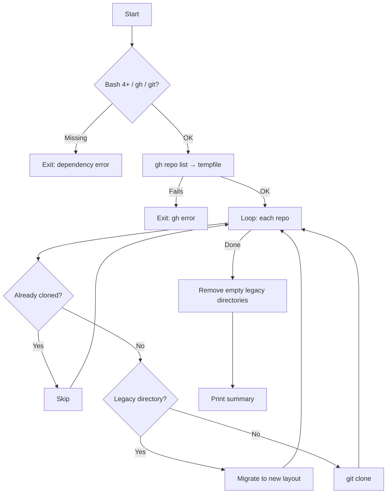

<p align="center">
  
</p>

<h1 align="center">clone-gh-repos</h1>

<p align="center">
  <strong>The only GitHub cloning tool that organises repositories by visibility and language — automatically.</strong>
</p>

<p align="center">
  <a href="https://github.com/sebastienrousseau/clone-gh-repos/actions"></a>
  <a href="https://github.com/sebastienrousseau/clone-gh-repos/releases/latest"></a>
  <a href="LICENSE"></a>
</p>

---

clone-gh-repos is a single-file Bash tool that clones every repository from a GitHub user or organisation and sorts them into `Public/` and `Private/` trees, grouped by primary language. It runs on macOS, Linux, and WSL2 with no configuration.

---

## Why clone-gh-repos

Most cloning tools dump every repository into a single flat directory. Finding anything means scrolling through hundreds of folders with no structure.

clone-gh-repos creates a clean, navigable local mirror — sorted by visibility and language — in one command.

```
~/Code/
├── Public/
│   ├── rust/
│   │   └── my-crate/
│   ├── typescript/
│   │   └── my-app/
│   └── other/
│       └── dotfiles/
└── Private/
    └── python/
        └── internal-tool/
```

One script. No install step. No config files. No runtime dependencies beyond `gh` and `git`.

---

## How It Compares

| Feature | clone-gh-repos | [ghorg](https://github.com/gabrie30/ghorg) | [ghcloneall](https://pypi.org/project/ghcloneall/) | Gist scripts |
|:---|:---|:---|:---|:---|
| Organises by language | Yes | No | No | No |
| Organises by visibility | Yes | No | No | No |
| Zero install | Yes (single bash file) | Go binary or Docker | Python + pip | Copy-paste |
| Idempotent re-runs | Yes | Yes | Yes | No |
| Legacy layout migration | Yes | No | No | No |
| Test suite | 32 tests, CI on 2 OS | Yes | Limited | None |
| macOS, Linux, and WSL2 | Yes (CI on both) | Yes | Linux only | Varies |
| Config required | None | YAML + env vars | CLI flags + rc file | Manual edits |

---

## Get Started

clone-gh-repos runs anywhere Bash 4+ is available: macOS, Ubuntu, Debian, Fedora, Arch, and Windows via WSL2.

### 1. Install the prerequisites

| Tool | macOS | Ubuntu / Debian / WSL2 | Fedora / RHEL |
|:-----|:------|:-----------------------|:--------------|
| Bash 4+ | `brew install bash` | Pre-installed | Pre-installed |
| [Git](https://git-scm.com/) | `brew install git` | `sudo apt install git` | `sudo dnf install git` |
| [GitHub CLI](https://cli.github.com/) | `brew install gh` | `sudo apt install gh` | `sudo dnf install gh` |

> **WSL2 users:** Run all commands inside your Linux distribution, not from PowerShell or CMD. The script works identically to native Linux.

### 2. Authenticate with GitHub

```bash
gh auth login
```

### 3. Clone

```bash
./clone-gh-repos.sh <owner> [base_dir] [limit]
```

| Parameter | Required | Default | Description |
|:----------|:---------|:--------|:------------|
| `owner` | Yes | — | GitHub username or organisation |
| `base_dir` | No | `$HOME/Code` | Root directory for the cloned tree |
| `limit` | No | `1000` | Maximum repositories to fetch |

Clone a personal account:

```bash
./clone-gh-repos.sh my-username
```

Clone an organisation into a custom directory:

```bash
./clone-gh-repos.sh my-org ~/Projects 500
```

Private repositories require a `gh` token with appropriate access. Public repositories from any account are always available.

---

## Features

| Feature | Description |
|:---|:---|
| **Structured** | The only tool that sorts repositories into `Public/` and `Private/` trees, grouped by primary language. |
| **Idempotent** | Safe to re-run at any time. Already-cloned repositories are skipped. Only new ones are fetched. |
| **Migratory** | Flat `~/Code/<Language>/` layouts from earlier runs move into the new structure automatically. |
| **Cross-platform** | Runs on macOS, Ubuntu, Debian, Fedora, Arch, and Windows via WSL2. CI tests on Ubuntu and macOS. LF line endings enforced via `.gitattributes`. |
| **Zero-config** | No YAML, no `.env`, no config files. Pass the owner name and run. |
| **Fail-safe** | Pre-flight checks for `gh`, `git`, and Bash version. Clear error messages on failure. |
| **Production-grade** | 32 automated tests. CI on Ubuntu and macOS. Signed commits. ShellCheck clean. |

---

## How It Works



---

## Legacy Migration

Earlier versions of this script stored repositories in a flat `~/Code/<Language>/<repo>` layout. When the script encounters these directories, it moves them into the new `<Visibility>/<Language>/<repo>` structure. Empty legacy language folders are removed afterward.

---

## Troubleshooting

| Message | Cause | Solution |
|:--------|:------|:---------|
| `ERROR: Bash 4+ is required` | macOS includes Bash 3.2 by default | `brew install bash` |
| `ERROR: Required command 'gh' not found` | GitHub CLI is not installed | See Get Started above |
| `ERROR: gh repo list failed` | Not authenticated, or the owner does not exist | Run `gh auth login` and verify the owner name |
| `FAILED: owner/repo` | Network issue or protocol mismatch | Check connectivity. Run `gh config set git_protocol https` |
| Script reports 0 repos | No repositories visible to the current token | Run `gh repo list <owner> --limit 5` to verify |
| `\r: command not found` (WSL2) | Windows line endings in the script | Run `dos2unix clone-gh-repos.sh` or re-clone with `git config core.autocrlf input` |

---

## FAQ

**Can clone-gh-repos back up private repositories?**
Yes. Any repository visible to the authenticated `gh` token is cloned. Private repositories land in the `Private/` tree.

**Does it work with GitHub organisations?**
Yes. Pass the organisation name as the first argument. Both user accounts and organisations are supported.

**What happens if a repository is deleted on GitHub?**
The local clone remains untouched. The script never deletes existing directories.

**Does it work on Windows?**
Yes, through WSL2. Install a Linux distribution from the Microsoft Store, open its terminal, and run the script there. It behaves identically to native Linux.

**Does it work on macOS with the default shell?**
macOS ships with Bash 3.2. Run `brew install bash` to get Bash 4+, then invoke the script with the Homebrew-installed Bash or add it to your `$PATH`.

**Is it safe to run on a schedule (cron)?**
Yes. The script is idempotent — existing repos are skipped, only new ones are cloned. No interactive prompts.

---

## Security

See [SECURITY.md](SECURITY.md).

---

## Contributing

See [CONTRIBUTING.md](CONTRIBUTING.md).

---

## License

Released under the [GNU General Public License v3.0](LICENSE).

<p align="right"><a href="#clone-gh-repos">Back to Top</a></p>
